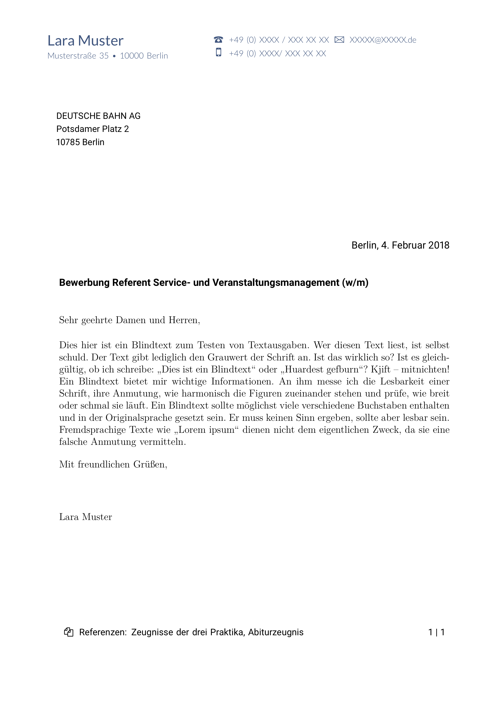
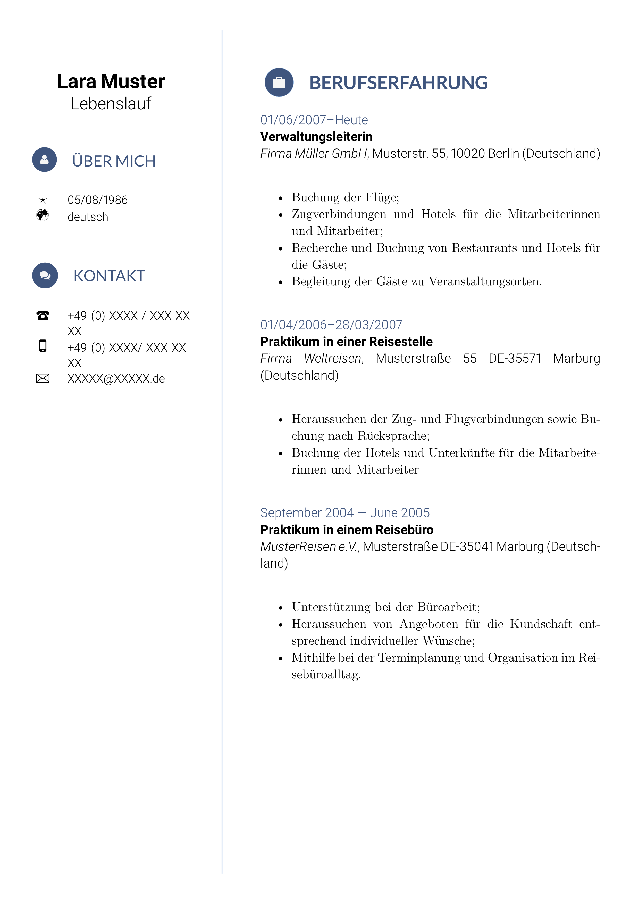

# ABOUT
 
A LaTeX package for writing classy job applications.

## FEATURES

* various easy-to-use **commands for drawing components** (such as headings with icons and small charts)
* provision of **default components** (for cover letter and resume and their nested components)
* high level of **customization** (through command and enviroment options as well as custom component defintions)
* support for **standardized letter formats** for cover letter (such as DIN-5008 compliant letters)

# USAGE

## GETTING STARTED

Create a folder for your cv (not required but recommended). Simply copy the file at the path

> LaTeX/classycv/source/classycv.cls

within the *LaTeX* repository into the same folder. Then create a cv file `<file-name>.tex` and follow the instructions in the section below.

**Note:** Another option is to add `source/classycv.cls` as a local class file. The correct way of adding a local class file depends on your platform and LaTeX distribution. A thorough instruction for multiple platforms/distributions can be found on [Stack Overflow](http://tex.stackexchange.com/questions/1137/where-do-i-place-my-own-sty-or-cls-files-to-make-them-available-to-all-my-te).

## CREATING A BASIC CV

In your `<file-name>.tex` file set the document class to `classycv` using the `\documentclass` command (the options `a4paper, 12pt` for default paper size and default font size are recommended but not required). 

A tpyical document created with this class contains

1. one **cover letter** (using the `CoverLetter` environment)
2. one **resume** (using the `Resume` environment)
3. multiple **attachments** (using the `attachment` command)

A template for a basic cv document is given below:

```
\documentclass[a4paper, 12pt]{classycv}

\begin{document}

%! Cover letter.
\begin{CoverLetter}[<options?>]{<submitter-information>}{<recipient-information>}{<subject-line>}{<opening-line>}{<closing-line>}
<body-text>
\end{CoverLetter}

%! Resume
\begin{Resume}[<options>]{<data>}%
<resume-text>
\end{Resume}

%! Attachments
\attachment[<options>][<name>][<pdf-options>]{<file-1>}
...
\attachment[<options>][<name>][<pdf-options>]{<file-N>}
\end{document}
```

## PUBLIC INTERFACE

*classycv* exposes the global commands

* `\classycvSet` (set the value of the data entry associated with the given key)
* `\classycvGet` (get the value of the data entry associated with the given key)
* `\classycvClear` (clear the value of the data entry associated with the given key)
* `\classycvDefineComponent` (define a component identified by a path)
* `\attachment`

and the environments

* `CoverLetter`
* `Resume`

Additional commands become available within environments through local aliases. These are listed in subsections for the respective command or environment.

## CUSTOMIZATION

### THE BASICS

*classycv* provides an **extension** and **modification** mechanism by exposing `\classycvDefineComponent`. This command allows the user to define a custom command for any of the components used by the output creating commands and environments (such as `CoverLetter`, `Resume` and `attachment`).

Components are identified by *keys* (e.g. `/cover letter/header` identifies the the component creating the header of the cover letter). The keys reflect the logical structure of the document. Defining a component identified by `<key>` changes the command used for creating the output. This allows in-depth customization.

### EXAMPLES

#### Removing a Component
You can remove any component identified by `<key>` through
```
 \classycvDefineComponent{<key>}{}
```
where `<key>` is a placeholder for a component identifier key.

#### Adding a Quote to your Resume

The resume format *Thirty Seventy* defines an initially empty component identified by the key `/resume/left/extra data` which allows you to add something to the left side bar. Adding a quote to the left side bar then is as easy as providing a definition of `/resume/left/extra data`:
```
\classycvDefineComponent{/resume/left/extra data}{%
	\vspace*{2em}\bar{white}\par
 	\adjustbox{margin={12pt 0pt}, minipage=\linewidth-24pt}{
		{\lmrfamily\larger``La simplicité est la ré\-us\-site ab\-so\-lue.''}
		
		\vspace*{1em}--- Frédéric Chopin
	 }
}
```

**Note:** The definition has to be put before the call to the `Resume` environment which is supposed to add the component.

### THE `CoverLetter` ENVIRONMENT

Basic syntax for this environment is

```
\begin{CoverLetter}[<options>]{<submitter-information>}{<recipient-information>}{<subject-line>}{<opening-line>}{<closing-line>}
<body-text>
\end{CoverLetter}
```

where identifiers in angle brackets (e.g. `<options>`) signify a code or text place holder.

#### Option keys and meaning

Options keys and their meaning depend on the cover letter format and are shown in the respective section.

#### Mandatory arguments

##### First argument (submitter information)

Provides a *pgfkeys* key-val interface (entries of format `<key>=<value>` delimited by commas) to setting submitter information. Example submitter information entries  are `title`, `name` and the address values (`street`, `house`, `zipcode`, `city`, `country`).

Available keys:

* `title`: submitter title (such as "Dr.")
* `name`: submitter full name (first and last name)
* `organisation`: submitter organisation name (such as "Apple Inc.")
* `position`: submitter job position (such as "CEO")
* `street`: submitter street name
* `house`: submitter house number
* `zipcode`: submitter postal zipcode
* `city`: submitter city name
* `country`: submitter country of residence
* `phone`: submitter landline phone number
* `mobile`: submitter mobile phone number
* `fax`: submitter fax number
* `email`: submitter email address
* `website`: submitter website address
* `date`: submission date
* `attachments`: attachment file names or description

**Note:** Unless otherwise indicated all values are initially and by default set to `\@empty`. If no value is provided the corresponding lines or components are omitted.

##### Second argument (recipient information)

Provides a *pgfkeys* key-val interface (entries of format `<key>=<value>` delimited by commas) to setting recipient information. Example recipient information entries are `title`, `name` and the address values (`street`, `house`, `zipcode`, `city`, `country`).

Available keys:

* `title`: recipient title (such as "Dr.")
* `name`: recipient full name (first and last name)
* `organisation`: recipient organisation name (such as "Apple Inc.")
* `position`: recipient job position (such as "CEO")
* `street`: recipient street name 
* `house`: recipient house number
* `zipcode`: recipient postal zipcode
* `city`: recipient city name 
* `counter`: recipient country name

**Note:** Unless otherwise indicated all values are initially and by default set to `\@empty`. If no value is provided the corresponding lines or components are omitted.

##### Third argument (subject line)

The letter subject such as 

> "Application — Senior Software Developer (f/m)"

##### Fourth argument (opening line)

The letter opening line such as 

> "To who it may concern,"

##### Fifth argument (closing line)

The letter closing line such as 

> "Kind regards,"

### COVER LETTER FORMATS

In general

#### DIN 5008 A

##### General Information

This cover letter format conforms to the DIN 5008 A letter format (see: https://de.wikipedia.org/wiki/DIN_5008) with a few liberties. 

DIN 5008 A format positions the address field such that the address field is shown in the window of a standard german "Großbrief" envelope. 

##### Components

The format uses the following components:

* *header* (creates the cover letter header; key: `/cover letter/header`, default: yes)
* *footer* (creates cover letter footer; key: `/cover letter/footer`, default: yes)
* *recipient information* (creates the cover letter recipient information, e.g. the address lines; key: `/cover letter/recipient information`, default: yes)
* *submnitter information* (creates the cover letter submitter information usable for additional information not contained within the header; key: `/cover letter/submitter information`, default: no)
* *subject* (creates the subject line in the letter body; key: `/cover letter/subject`, default: yes)
* *date* (creates the date line in the letter body; key: `/cover letter/date`, default: yes)
* *opening* (creates the opening line in the letter body; key: `/cover letter/opening`, default: yes)
* *closing* (creates the closing line in the letter body; key: `/cover letter/closing`, default: yes)
* *attachments* (creates the attachments line in the letter footer; key: `/cover letter/attachments`, default: yes)

##### Options and Meaning

**Note:** (to be added)

#### DIN 5008 B

**Note:** (to be added)

##### Options and Meaning

**Note:** (to be added)

### THE `Resume` ENVIRONMENT

#### Option keys and meanings

**Note:** (to be added)

#### Mandatory arguments

**Note:** (to be added)

#### Local commands and environments

The commands 

* `\heading` (draws a simple heading with optional label)
* `\bar` (draws a simple horizontal line)
* `\progress` (draws a progress bar)
* `\semicircle` (draws a semicircle with optional label)	
* `\doughnut` (draws a doughnut chart with labels)

and the environments 

* `Table` (a wrapper for the environment `tabular` with additional options).
* `Entry` (for a simple entry in a chronological cv)

are provided locally within the `Resume` environment.

#### RESUME FORMATS

##### **Thirty Seventy** Resume Format

**Note:** (to be added)

### THE `\attachment` COMMAND

**Note:** (to be added)

# EXAMPLES

All examples may be found in the folder `examples` of this repository.

## GERMAN EUROPASS CV EXAMPLE

The output for this example can be found at `./examples/cv_de.pdf`. It is compiled from the the source file `./examples/cv_de.tex`. 

The example pdf used as a template is provided by the *European Union*'s organisation *Europass* and may be found [here](https://europass.cedefop.europa.eu/sites/default/files/cv-example-1-de_de.pdf). 

Output samples are provided below.

### COVER LETTER


### FIRST PAGE OF RESUME

