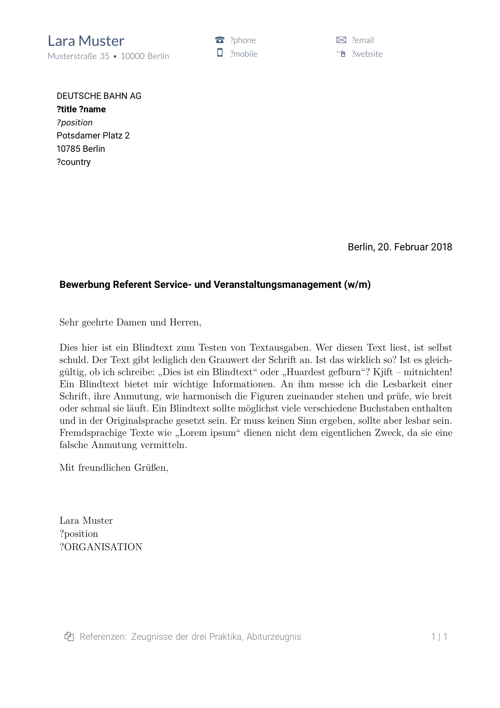
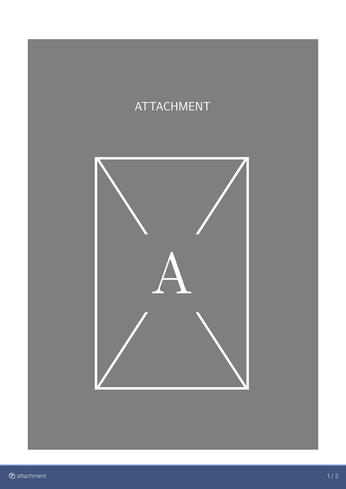
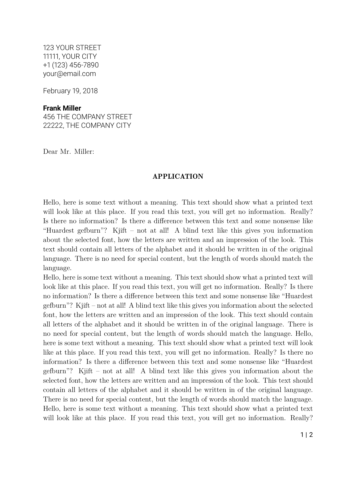
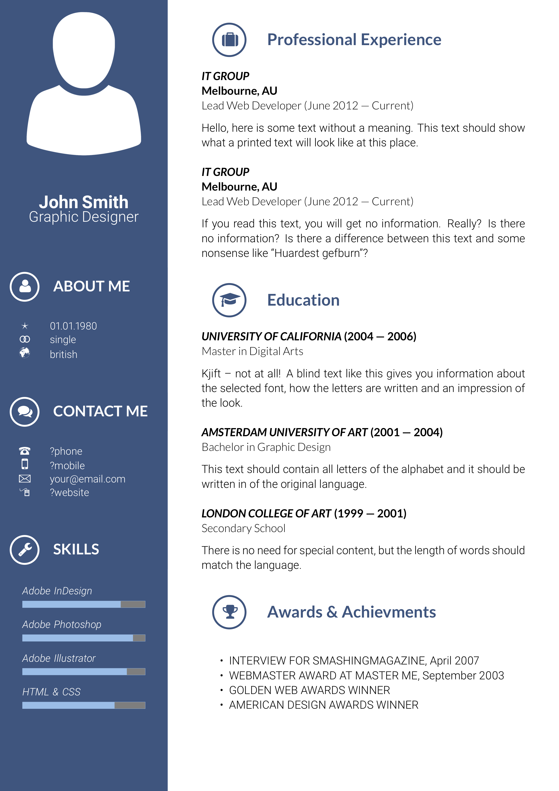

# ABOUT
 A LaTeX package for writing classy job applications.

## FEATURES
* commands and environments for basic cv elements

	Such as
	+ **cover letter**
	+ **resume** 
	+ **attachment**
* various easy-to-use **commands for drawing components** 

	Such as headings with icons and small charts.
* provision of **default components** 

	For cover letter and resume.
* high level of **customization** 

	Through command and enviroment options as well as  custom component definitions.
* support for **standardized letter formats** 

	For example
	+ **US business letter** format
	+ German **DIN-5008** format

# USAGE
## GETTING STARTED
Create a folder for your cv (not required but recommended). Simply copy the file at the path

> classycv/source/classycv.cls

within the *LaTeX* repository into the same folder. Then create a cv file `<file-name>.tex` and follow the instructions in the section below.

> **Note:** Another option is to add `source/classycv.cls` as a local class file. Typically, this only involves putting the class file into a directory indexed by your LaTeX distribution.
> This [Stack Overflow answer](https://tex.stackexchange.com/a/1167/48139) lists the commonly used directories on various platforms.

## CREATING A BASIC CV
In your `<file-name>.tex` file set the document class to `classycv` using the `\documentclass` command (the options `a4paper, 12pt` for default paper size and default font size are recommended but not required). 

```tex
	\documentclass[a4paper, 12pt]{classycv}
```

A typical document created with this class contains

1. one **cover letter** (using the `CoverLetter` environment)
2. one **resume** (using the `Resume` environment)
3. multiple **attachments** (using the `attachment` command)

You can find a starter template for a basic cv document in the [examples](#EXAMPLES) section.

Another way is to adapt one of the example cvs in the folder `classycv/examples`.

## PUBLIC INTERFACE
### OVERVIEW
*classycv* exposes the global configuration commands

* `\classycvSet` (set the value of the data entry associated with the given key)
* `\classycvGet` (get the value of the data entry associated with the given key)
* `\classycvClear` (clear the value of the data entry associated with the given key)
* `\classycvDefineComponent` (define a component identified by a path)

as well as the commands and environments.
* `\attachment`
* `CoverLetter`
* `Resume`

Additional commands become available within environments through local aliases. These are listed in subsections for the respective command or environment.

### THE `CoverLetter` ENVIRONMENT
Basic syntax for this environment is

```tex
\begin{CoverLetter}[<options>]{%
	<submitter-information>%
}{%
	<recipient-information>%
}{%
	<subject-line>%
}{%
	<opening-line>%
}{%
	<closing-line>%
}%
<body-text>
\end{CoverLetter}
```

where identifiers in angle brackets (e.g. `<options>`) signify a code or text place holder.

#### Option keys and meaning
Options keys and their meaning depend on the cover letter format and are shown in the respective section.

#### Mandatory arguments
##### First argument (submitter information)
Provides a *pgfkeys* key-val interface (entries of format `<key>=<value>` delimited by commas) to setting submitter information. Example submitter information entries  are `title`, `name` and the address values (`street`, `house`, `zipcode`, `city`, `country`).

Available keys:

* `title`: submitter title (such as "Dr.")
* `name`: submitter full name (first and last name)
* `organisation`: submitter organisation name (such as "Apple Inc.")
* `position`: submitter job position (such as "CEO")
* `street`: submitter street name
* `house`: submitter house number
* `zipcode`: submitter postal zipcode
* `city`: submitter city name
* `country`: submitter country of residence
* `phone`: submitter landline phone number
* `mobile`: submitter mobile phone number
* `fax`: submitter fax number
* `email`: submitter email address
* `website`: submitter website address
* `date`: submission date
* `attachments`: attachment file names or description

**Note:** Unless otherwise indicated all values are initially and by default set to `\@empty`. If no value is provided the corresponding lines or components are omitted.

##### Second argument (recipient information)
Provides a *pgfkeys* key-val interface (entries of format `<key>=<value>` delimited by commas) to setting recipient information. Example recipient information entries are `title`, `name` and the address values (`street`, `house`, `zipcode`, `city`, `country`).

Available keys:

* `title`: recipient title (such as "Dr.")
* `name`: recipient full name (first and last name)
* `organisation`: recipient organisation name (such as "Apple Inc.")
* `position`: recipient job position (such as "CEO")
* `street`: recipient street name 
* `house`: recipient house number
* `zipcode`: recipient postal zipcode
* `city`: recipient city name 
* `counter`: recipient country name

**Note:** Unless otherwise indicated all values are initially and by default set to `\@empty`. If no value is provided the corresponding lines or components are omitted.

##### Third argument (subject line)
The letter subject such as 

> "Application — Senior Software Developer (f/m)"

##### Fourth argument (opening line)
The letter opening line such as 

> "To who it may concern,"

##### Fifth argument (closing line)
The letter closing line such as 

> "Kind regards,"

#### COVER LETTER FORMATS
##### US Business Letter (Block Format)

A standard [US business letter](https://en.wikipedia.org/wiki/Business_letter) in block format.

This format left aligns the whole letter and adds a bold subject line after the salutation.

> **NOTE**:
> You can select the US business letter (block format) by adding
> ```latex
> \classycvSet{/settings/cover letter/format}{us-block}
> ```
> to your document preamble.

##### DIN 5008 A
This cover letter format conforms to the [DIN 5008 A  letter format](https://de.wikipedia.org/wiki/DIN_5008#/media/File:DIN_5008,_Form_A.svg) with a few liberties. 

DIN 5008 A format positions the address field such that the address field is shown in the window of a standard german "Großbrief" envelope. 

> **NOTE**:
> You can select DIN 5008 A format for your cover letter format by adding
> ```latex
> \classycvSet{/settings/cover letter/format}{din-5008-a}
> ```
> to your document preamble.

The format uses the following components:

* *header* (creates the cover letter header; key: `/cover letter/header`, default: yes)
* *footer* (creates cover letter footer; key: `/cover letter/footer`, default: yes)
* *recipient information* (creates the cover letter recipient information, e.g. the address lines; key: `/cover letter/recipient information`, default: yes)
* *submnitter information* (creates the cover letter submitter information usable for additional information not contained within the header; key: `/cover letter/submitter information`, default: no)
* *subject* (creates the subject line in the letter body; key: `/cover letter/subject`, default: yes)
* *date* (creates the date line in the letter body; key: `/cover letter/date`, default: yes)
* *opening* (creates the opening line in the letter body; key: `/cover letter/opening`, default: yes)
* *closing* (creates the closing line in the letter body; key: `/cover letter/closing`, default: yes)
* *attachments* (creates the attachments line in the letter footer; key: `/cover letter/attachments`, default: yes)

##### Options and Meaning
**Note:** (to be added)

##### Options and Meaning
**Note:** (to be added)

### THE `Resume` ENVIRONMENT
#### Option keys and meanings
**Note:** (to be added)

#### Mandatory arguments
**Note:** (to be added)

#### Local commands and environments
The commands 

* `\heading` (draws a simple heading with optional label)
* `\bar` (draws a simple horizontal line)
* `\progress` (draws a progress bar)
* `\semicircle` (draws a semicircle with optional label)	
* `\doughnut` (draws a doughnut chart with labels)

and the environments 

* `Table` (a wrapper for the environment `tabular` with additional options)
* `List` (a wrapper for the `itemize` environment with additional options)
* `Entry` (for a simple entry in a chronological cv)

are provided locally within the `Resume` environment.

#### RESUME FORMATS
##### **Classic** Resume Format
**Note:** (to be added)

##### **Modern** Resume Format
**Note:** (to be added)

### THE `\attachment` COMMAND
**Note:** (to be added)

# CUSTOMIZATION
## THE BASICS
*classycv* provides an **extension** and **modification** mechanism by exposing `\classycvDefineComponent`. This command allows the user to define a custom command for any of the components used by the output creating commands and environments (such as `CoverLetter`, `Resume` and `attachment`).

Components are identified by *pgfkeys* paths (e.g. `/cover letter/header` identifies the the component creating the header of the cover letter). The keys reflect the logical structure of the document. Defining a component identified by `<key>` changes the command used for creating the output. This allows in-depth customization.

## CUSTOMIZATION EXAMPLES
### Removing a Component
You can remove any component identified by `<key>` through
```tex
 \classycvDefineComponent{<key>}{}
```
where `<key>` is a placeholder for a component identifier key.

### Adding a Quote to your Resume
The *modern* resume format defines an—initially empty—component identified by the key `/resume/left/extra data`. Providing a definition for this component allows you to add something to the left part of the resume page. If you for example want to add the following quote by Frédéric Chopin
> *"La simplicité est la réussite absolue."*
> 
> — Frédéric Chopin

simply add the following code to your document preamble.

```tex
\classycvDefineComponent{/resume/left/extra data}{%
    \begin{adjustbox}{padding=12pt, minipage={\linewidth}}
        \bar{white}%
        \larger%
        {\textit{``La simplicit\'e est la r\'e\-us\-site ab\-so\-lue.''}}
        \\[0.5\baselineskip]%
        --- Fr\'ed\'eric Chopin%
    \end{adjustbox}
}
```

**Note:** The definition has to be put before the call to the `Resume` environment which is supposed to add the component.

# EXAMPLES
All examples may be found in the folder `examples` of this repository.

## CV TEMPLATE
```tex
\documentclass[a4paper, 12pt]{classycv}

%
% Chose cover letter and resume format
%
\classycvSet{/settings/resume/cover letter}{%
	% COVER LETTER FORMAT
}
\classycvSet{/settings/resume/format}{%
	% RESUME FORMAT
}

\begin{document}

%
% Cover letter.
%
\begin{CoverLetter}[%
	% COVER LETTER OPTIONS
]{%
	% SUBMITTER INFORMATION
}{%
	% RECIPIENT INFORMATION
}{%
	% SUBJECT LINE
}{%
	% OPENING LINE
}{%
	% CLOSING LINE
}%
	% COVER LETTER TEXT
\end{CoverLetter}

%
% Resume
%
\begin{Resume}[%
	% RESUME OPTIONS
]{%
	% RESUME DATA
}%
	% RESUME TEXT
\end{Resume}

%
% Attachments
%
\attachment[%
	% ATTACHMENT OPTIONS
][%
	% ATTACHMENT NAME
][%
	% PDF OPTIONS
]{%
	% FILE PATH
}
\end{document}
```

## CLASSIC CV EXAMPLE
The output for this example can be found at `./examples/classic/cv.pdf`. It is compiled from the the source file `./examples/classic/cv.tex`. 

We are using a german example cv from the European Union's **Europass** program as inspiration (to be found [here](https://europass.cedefop.europa.eu/sites/default/files/cv-example-1-de_de.pdf)). 

Output samples are provided below.

### COVER LETTER
> 

### FIRST PAGE OF RESUME
> 

### ATTACHMENTS FIRST PAGE
> 

## MODERN CV EXAMPLE
This is an english cv using the *US business letter* format for the cover letter and the *modern* resume format.

The output for this example can be found at `./examples/modern/cv.pdf`. It is compiled from the the source file `./examples/modern/cv.tex`. 

> **NOTE**:
> A resume in *modern* format does not have margins for printing. If you intend to print your resume (or expect it to be printed at some point), you should choose a resume format with margins (e.g. *classic*) instead.

Output samples are provided below.

### COVER LETTER
> 

### FIRST PAGE OF RESUME
> 

### ATTACHMENTS FIRST PAGE
> 
