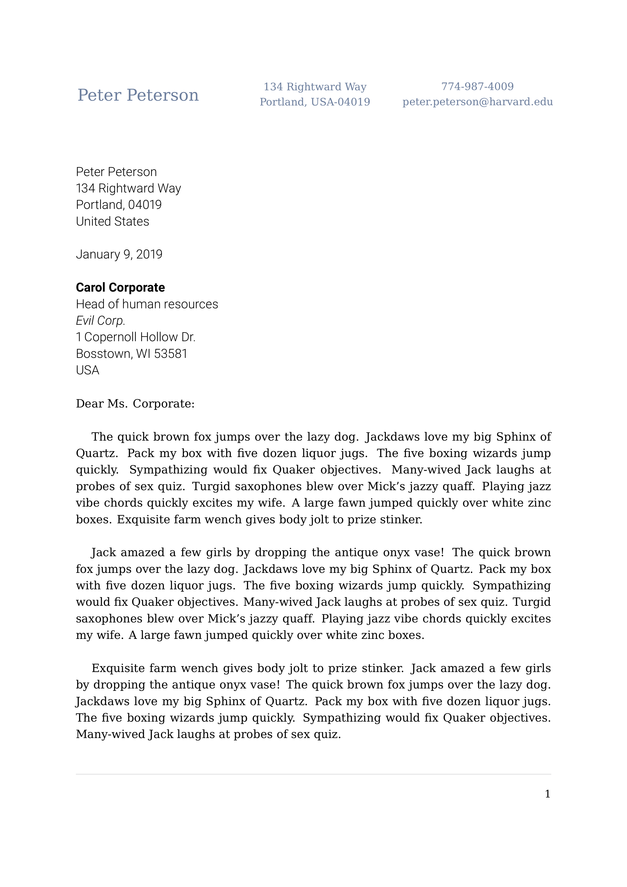
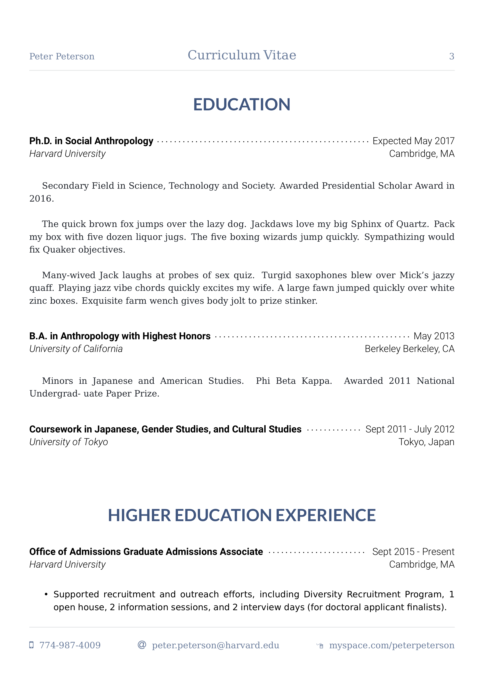
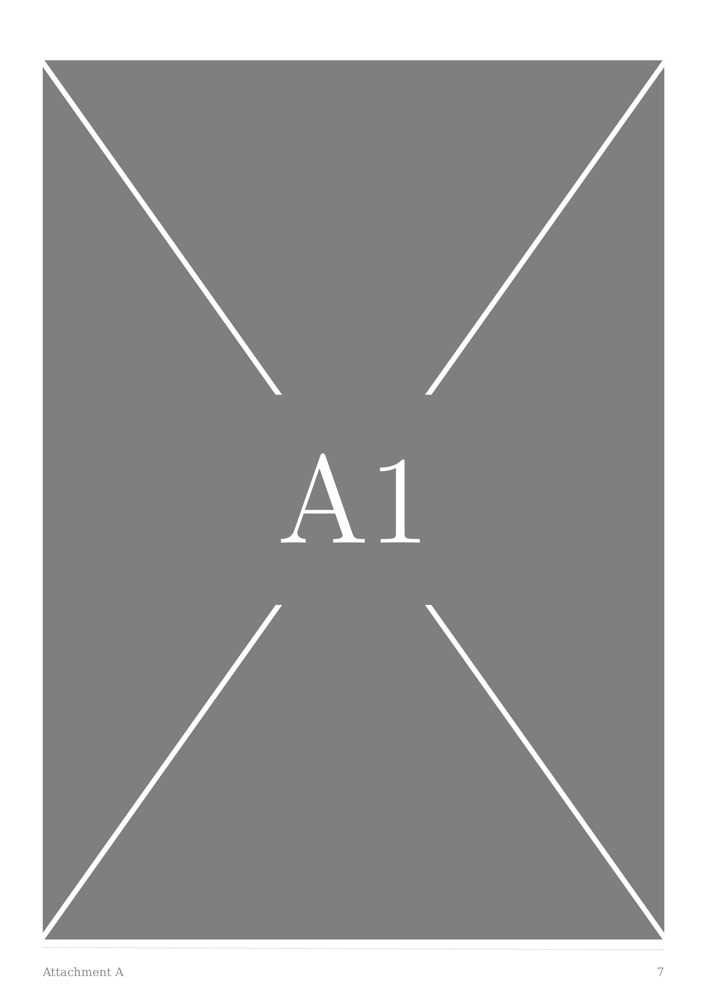
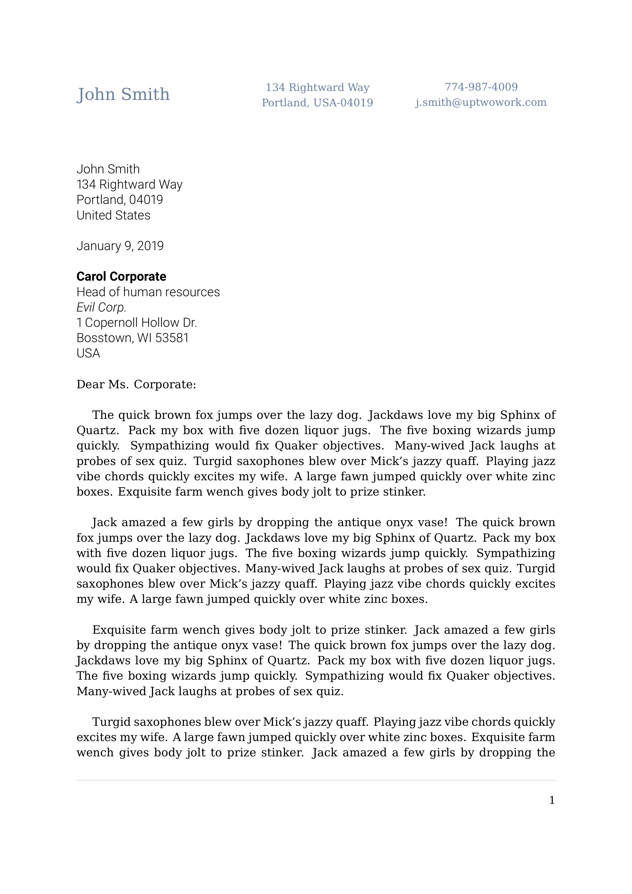
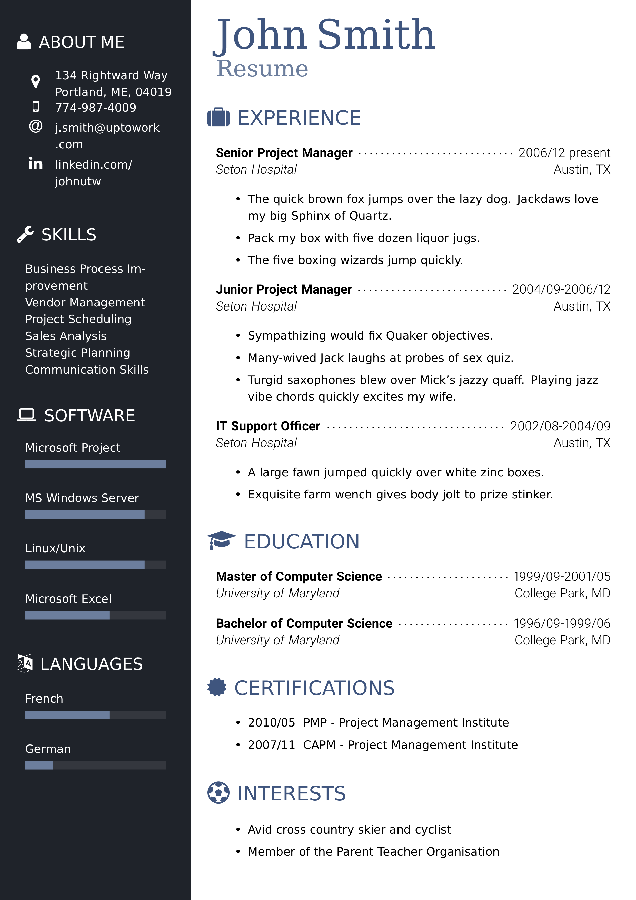

# classycv

This package contains the LaTeX class `classycv.cls` for classy job applications, including a themes and extension library.

## Getting Started

### 1. Register classycv source files

**Note:** The following instructions are for macOS 10.14.2 and assume that [MacTeX][2] is installed. Instructions for other platforms can be found in [this StackOverflow thread][1].

Clone this repository into your local `texmf` directory

```bash
cd ~/Library/texmf/tex/latex
git clone https://github.com/classysoftware/classycv.git
```

Verify by running `ls -l`. The output should show an entry for the `classycv` folder where (`<user>` and `<group>` are placeholders for your user name and user group).

```bash
$ ls -l
# ...
drwxr-xr-x  11 <user>  <group>  352  9 Jan 13:53 classycv
```

Run `texhash` as super user to add classycv's class and style files to the index.

```bash
sudo texhash
```

### 2. Create cv project folder and add content

Change to a directory of your choice and create a project folder (we simply use `~/Desktop` and `example-cv` as the folder name in this example)

```bash
cd ~/Desktop
mkdir cv-example
cd cv-example
```

Add a file `cv.tex` with the content of the [harvard cv stub](#harvard-cv-stub) as a starting point. It should look like this (with some content omitted for brevity):

```tex
\documentclass[a4paper,11pt]{classycv}

\usepackage[utf8]{inputenc}
% ...

\classycvusetheme{harvard}
% ...

\submitter{%
% ...
}

\recipient{%
% ...
}

\begin{document}

\begin{coverletter}
% ...
\end{coverletter}

\begin{resume}
% ...
\end{resume}

\blindattachment[A]{Attachment A}
\blindattachment[B]{Attachment B}

\end{document}
```

**Note:** The commands are explained in the following section [_Public Interface_](#public-interface).

### 3. Compile your cv

**Note:** It is recommended to use `latexmk` with xelatex for compilation. If `latexmk` should not be installed on your system, follow the [the `latexmk` installation guide][3] before continuing.

Run the following command:

```bash
latexmk -pdfxe cv.tex && open cv.pdf
```

This should open the compiled PDF file for the harvard cv stub in your PDF viewer. You should see

- a two page cover letter, and
- a one page resume containing a section _Education_ with two sub-entries, and
- two pages of attachments.

## Public Interface

TODO

## Appendix

### Examples

#### Harvard CV Example

The following images show the first pages produced for the cover letter, resume, and attachments section of the **harvard theme** example cv in `examples/harvard/build/harvard.pdf`.

> 
>
> 
>
> 

#### Modern CV Example

The following images show the first pages produced for the cover letter, resume, and attachments section of the **modern theme** example cv in `examples/modern/build/harvard.pdf`.

> 
>
> 
>
> 

### CV Stubs

### Harvard CV Stub

```tex
\documentclass[a4paper,11pt]{classycv}

\usepackage[utf8]{inputenc}
\usepackage[T1]{fontenc}
\usepackage[english]{babel}
\usepackage[pangram]{blindtext}

\classycvusetheme{harvard}
\classycvuselibrary{attachments}
\classycvuselibrary{drawings}

\submitter{%
    , name=John Smith%,
    , street=Rightward Way%
    , house=134 %
    , city=Portland%
    , zipcode=04019%
    , country=United States%
    , countrycode=USA%
    , phone=774-987-4009%
    , email=j.smith@uptwowork.com%
    , website=linkedin.com/johnutw%
}

\recipient{%
    name=Carol Corporate%
    , position=Head of human resources%
    , company=Evil Corp.%
    , street=Copernoll Hollow Dr.%
    , house=1%
    , city=Bosstown%
    , zipcode=WI 53581%
    , country=USA%
}

\begin{document}

\begin{coverletter}
  \printSubmitter%
  \printDate{\today}%
  \printRecipient%
  \printSalutation{Dear Ms. Corporate:}%
  \Blindtext[2][10]
  \Blindtext[3][8]
  \printClosing{Best regards,}
  \printAttachments{Attachments: A, B}
\end{coverletter}

\begin{resume}
    %
    % Education
    %
    \vspace*{-4\baselineskip}
    \section{\MakeUppercase{Education}}
    \entry{Ph.D. in Social Anthropology}{Expected May 2017}{Harvard University}{Cambridge, MA}

    \begin{block}
        Secondary Field in Science, Technology and Society. Awarded Presidential Scholar Award in 2016.

        \Blindtext[1][2]
    \end{block}

    \entry{B.A. in Anthropology with Highest Honors}{May 2013}{University of California}{Berkeley Berkeley, CA}

    \begin{block}
        Minors in Japanese and American Studies. Phi Beta Kappa. Awarded 2011 National Undergrad- uate Paper Prize.
    \end{block}
\end{resume}

\blindattachment[A]{Attachment A}
\blindattachment[B]{Attachment B}

\end{document}
```

[1]: http://tex.stackexchange.com/questions/1137/where-do-i-place-my-own-sty-or-cls-files-to-make-them-available-to-all-my-te
[2]: http://www.tug.org/mactex/
[3]: https://mg.readthedocs.io/latexmk.html#installation
